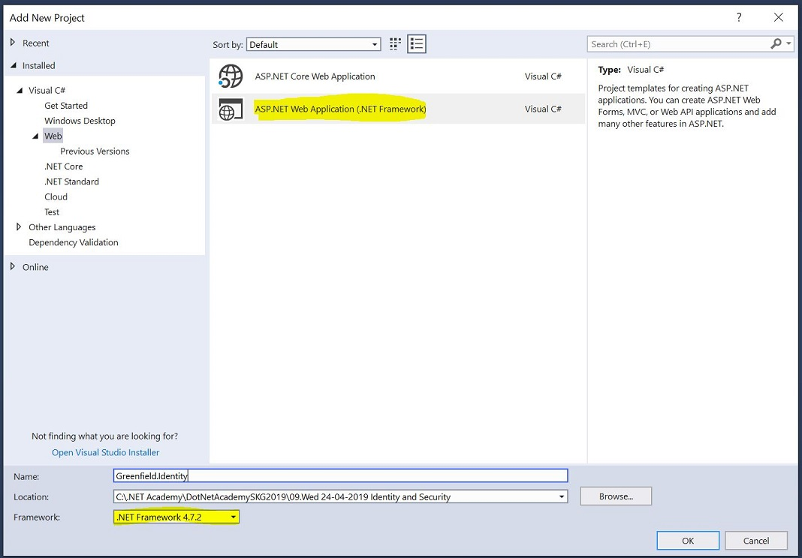
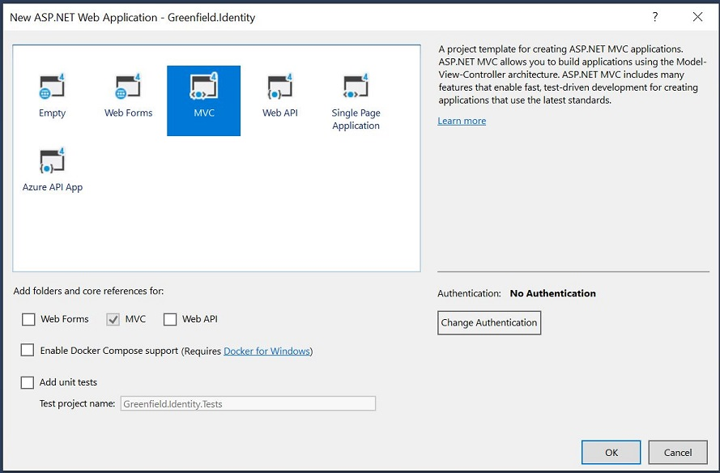
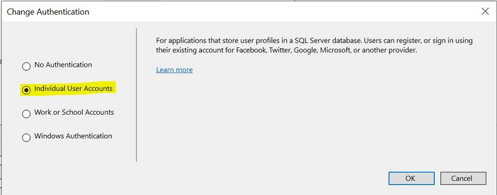

# Asp.net Identity and Security

[Official documentation](https://docs.microsoft.com/en-us/aspnet/identity/overview/getting-started/introduction-to-aspnet-identity)

## Create a blank new project with identity

In order to create a new MVC application that has out of the box support for identity and security we need to follow the steps below

- From the add new project dialog select `ASP.NET Web Application` item. Be careful to also select .net framework 4.7.2.
 

 - After filing a meaningful name we click on `OK` and in the next screen we select `MVC` as project type
 

 - Before clicking `OK` we need to also choose the Authentication type by clicking `Change Authentication` button. From the pop up dialog we choose `Individual User Accounts`
 

 - After this we select `OK` in both pop up and the main dialog. At this point Visual Studio is ready to create the project with all required references and nuget packages.

 - One last step is to update the connection string to the database. To do this we need to open `IdentityModel` file, and inside `ApplicationDbContext` class to add a string with the connection string value. After this the class should look like
   ```
    const string connectionString = @"Data Source=(LocalDb)\MSSQLLocalDB16;Initial Catalog=Greenfield.Identity;Integrated Security=True";

		public ApplicationDbContext()
			: base(connectionString, throwIfV1Schema: false)
		{
		}

		public static ApplicationDbContext Create()
		{
			return new ApplicationDbContext();
		}
   ```

## Add Identity to an existing project

### Add nuget packages and basic configuration

[Here](https://www.cnblogs.com/dupeng0811/p/adding-asp-net-mvc5-identity-authentication-to-an-existing-project.html) is a really comprehensive blog post that describes how to add asp.net identity resources to an existing mvc project.

### Add database migration

After we follow all the steps we also need to add the database migration that will create the required database tables.
To do this we need to execute the following command in the Package Manager Console window
```
Add-Migration
```
and then update the database by typing
```
Update-Database
```

### Add controller and views
At this stage we have all the required infrastructure to register as user and log in to the application.
We miss though the corresponding controller, viewmodel and views. To do this we need to copy the following items from Greenfield.Identity project
- Controllers/AccountController
- Models/AccountViewModels -> ViewModels
- Views/Account
- Views/Shared/_LoginPartial

The last step is to add another class inside Models folder with name `ApplicationSignInManager` and the following implementation

```
public class ApplicationSignInManager : SignInManager<ApplicationUser, string>
	{
		public ApplicationSignInManager(ApplicationUserManager userManager, IAuthenticationManager authenticationManager)
			: base(userManager, authenticationManager)
		{
		}

		public static ApplicationSignInManager Create(IdentityFactoryOptions<ApplicationSignInManager> options, IOwinContext context)
		{
			return new ApplicationSignInManager(context.GetUserManager<ApplicationUserManager>(), context.Authentication);
		}
	}
```

The last step is to add the following line in `IdentityConfig` class
```
app.CreatePerOwinContext<ApplicationSignInManager>(ApplicationSignInManager.Create);
```
At this moment we should be able to register as a user